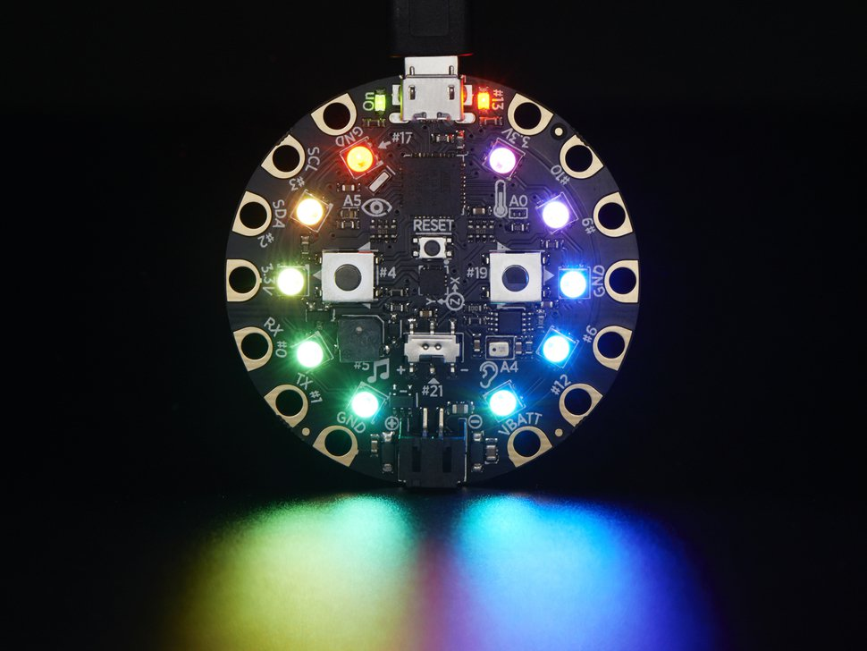
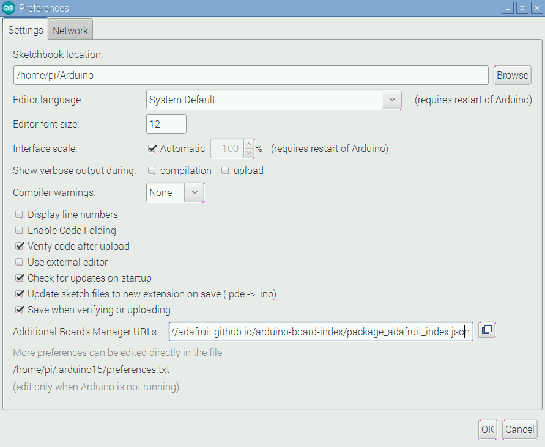
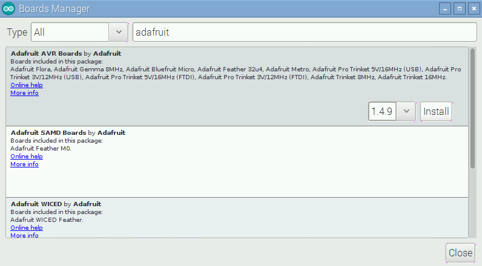
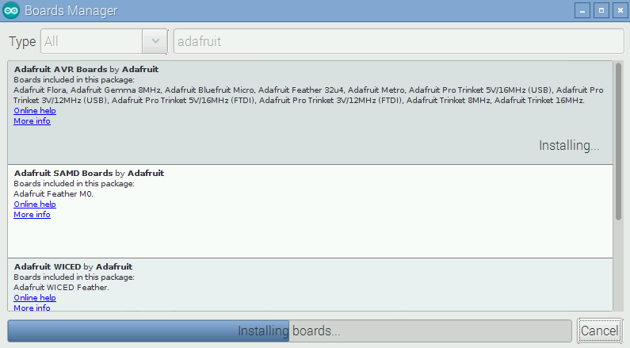
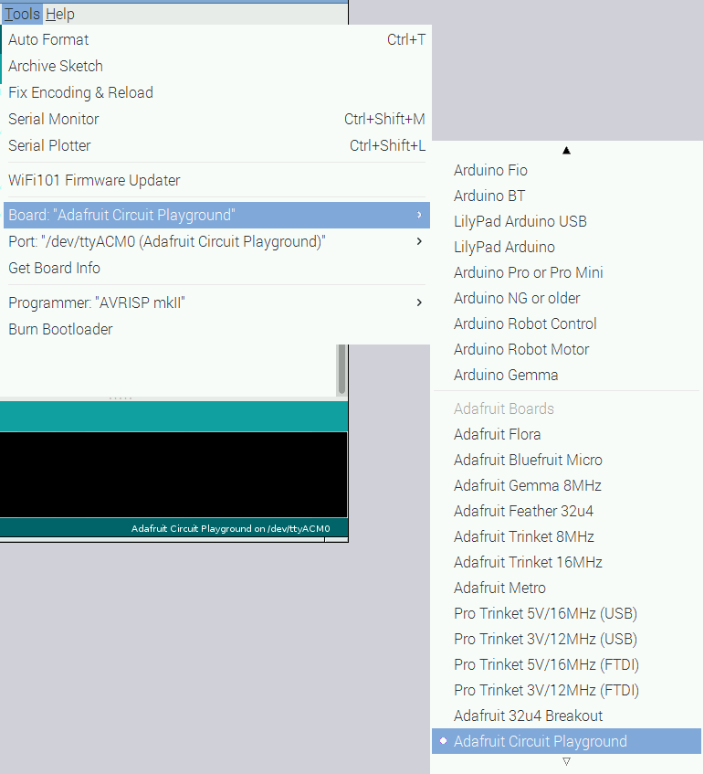
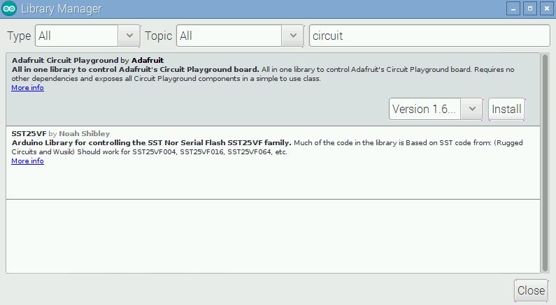
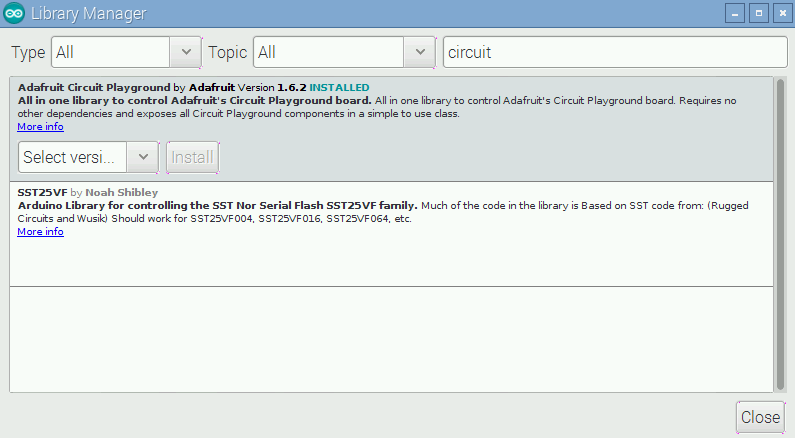

#Bioe 421/521: Microcontroller Applications
####Instructor: Jordan Miller<br>TA: Dan Sazer<br>github.com/jmil/Bioe421_521-MicrocontrollerApplications

##Lab 6C. The Circuit Playground

The Arduino is a beloved device because it's incredibly versatile -- in previous years of this class we used the DangerShield which lets you use those unused pins all over the Arduino Uno board. If you're interested in DangerShield you can read more in the `Attachments` folder of this lab repository and ask your instructor to see an assembled board:
https://www.sparkfun.com/products/11649
https://github.com/sparkfun/DangerShield


But there's a new Arduino-compatible board in town, the Circuit Playground made by Adafruit!

_Adafruit's Circuit Playground:_



It's so purty! But, you ask, what's all that neato stuff all over the board?!?!?! From [Adafruit.com](Adafruit.com):
[http://www.adafruit.com/products/3000](http://www.adafruit.com/products/3000)

>Would you like to learn electronics, with an all-in-one board that has sensors and LEDs built in? Circuit Playground is here - and it's the best way to practice programming on real hardware with no soldering or sewing required!

> Circuit Playground features an ATmega32u4 processor, just like our popular Flora. The board's also round and has alligator-clip pads around it so you don't have to solder or sew to make it work. You can power it from USB, a AAA battery pack, or with a Lipoly battery (for advanced users). Just program your code into the board then take it on the go!

>• ATmega32u4 Processor, running at 3.3V and 8MHz
>• MicroUSB port for programming and debugging with Arduino IDE
>• USB port can act like serial port, keyboard, mouse, joystick or MIDI
>
>Circuit Playground has built-in USB support. Built in USB means you plug it in to program it and it just shows up.  All you really need is a Micro-B data/sync USB cable - not included! With the new 1.6.4+ Arduino IDE, it takes only a few seconds to add support. The Circuit Playground has USB HID support, so it can act like a mouse or keyboard and attach directly to computers.

>Circuit Playground now works with Codebender as well!

>Here's some of the great goodies baked in:

>• 10 x mini NeoPixels, each one can display any color
>• 1 x Motion sensor (LIS3DH triple-axis accelerometer with tap detection, free-fall detection)
>• 1 x Temperature sensor (thermistor)
>• 1 x Light sensor (phototransistor)
>• 1 x Sound sensor (MEMS microphone)
>• 1 x Mini speaker (magnetic buzzer)
>• 2 x Push buttons, left and right
>• 1 x Slide switch
>• 8 x alligator-clip friendly input/output pins
>• Includes I2C, UART, and 4 pins that can do analog inputs/PWM output
>• All 8 pads can act as capacitive touch inputs
>• Green "ON" LED so you know its powered
>• Red "#13" LED for basic blinking
>• Reset button

>We've started out with a Developer Edition of Circuit Playground. This version is designed for people who have a little experience with Arduino already, who want to help build & document projects. There might be minor hardware or software bugs. Once we feel like the design is really solid we'll revise/re-release it into a universal edition for anyone to use!


Wow, that's a lot of stuff! Let's get setup to connect and program your Circuit Playground using Raspberry Pi.


### Install the latest Arduino


1. To program the Circuit Playground, we just load another Arduino sketch. Yay! But first we have to give `arduino` the proper library files so it can understand Circuit Playground. This is easiest to do in the latest version of `arduino`, which is not yet part of the lastest build of Raspbian OS. Let's first uninstall the default `arduino` environment and then manually grab and install a later version:

		$ sudo apt-get remove arduino
		$ cd ~/Downloads
		$ wget https://downloads.arduino.cc/arduino-1.6.11-linuxarm.tar.xz
		$ tar -xvf arduino-1.6.11-linuxarm.tar.xz
		$ ls -la
		$ cd arduino-1.6.11
		$ sudo ./install.sh
		
	When you call `sudo ./install.sh`, which program is actually used to process the `install.sh` file? How do you know?
	
		program:
		explanation:

1. Connect your Circuit Playground to your Raspberry Pi with the included micro USB cable. It should light up with the default sketch. But we still need to configure your Raspberry Pi to program it!


1. Launch the Arduino IDE (Recall: `Start Menu` -> `Programming` -> `Arduino IDE`). What version of `arduino` are you running? Show your instructor:

		:
		
		
### Configure Arduino IDE for Circuit Playground

1. We need to tell the Arduino IDE about the Circuit Playground. Hat-tip: https://learn.adafruit.com/add-boards-arduino-v164/setup

	Open `File` -> `Preferences` and very carefully type the following URL into the `Additional Boards Manager URLs:` field:
	
		https://adafruit.github.io/arduino-board-index/package_adafruit_index.json 
	
	It should look like this:
	
	**Additional Boards Manager URL:**
	
	
	Click `<OK>`.

	
1. Now, open `Tools` -> `Board:...` -> `Boards Manger...`

1. In the search field at the top, type `adafruit`. Install the latest version of `Adafruit AVR Boards` as shown in the following screenshots.

	**"adafruit" boards search result:**
	
	
	**"Adafruit AVR Boards" installing:**
	

	**"Adafruit AVR Boards" installation completed:**
	


1. After successful installation, make sure you have all the Adafruit Boards listed under `Tools` -> `Board:...`. Select `Adafruit Circuit Playground`.

	**"Adafruit Circuit Playground" board selected:**
	

1. Now we need to install the Circuit Playground Library files. We will follow a similar workflow as above.

1. In the Arduino IDE, navigate to `Sketch` -> `Include Library` -> `Manage Libraries...`. Search for `circuit`, and install the latest version of `Adafruit Circuit Playground`.

	**Search for "circuit" in the Library Manager:**
	

	**Installing "Adafruit AVR Boards":**
	

	**Library installation successful:**
	


1. Check that it was installed correctly. You should see a new entry under `Sketch` -> `Include Library` -> `Adafruit Circuit Playground` (down under the `Recommended libraries` heading).

	**"Adafruit Circuit Playground" library is available:**
	

1. Also install the `Adafruit SleepyDog Library` using the same procedure as above (simply search the Library Manager for `sleepy`). You will use this library later. Was it installed correctly? How do you know?

		: 


1. Phew. Ok, now we need to download a bunch of sample programs your Instructor has pulled together from various official and unofficial sources. In a terminal, let's grab the code using `git`:

		$ mkdir -p ~/github
		$ cd ~/github
		$ which git
		$ git clone https://github.com/jmil/Adafruit_CircuitPlayground.git
		$ ls -la
		$ cd Adafruit_CircuitPlayground
		$ ls -la
		

### Learn with Circuit Playground Sketches


A Circuit Playground sketch will generally call the `Adafruit_CircuitPlayground.h` file (using `#include`) which allows the sketch to access the functions optimized for this board. The simplest one is `CircuitPlayground.begin();` which is typically seen in the `setup()` function. Work with your lab partner to explain each line of the following source code for `Hello_Blink.ino`:

	#include <Adafruit_CircuitPlayground.h>

	void setup() {
	  CircuitPlayground.begin();
	}

	void loop() {
	  CircuitPlayground.redLED(HIGH);
	  delay(500);
	  CircuitPlayground.redLED(LOW);
	  delay(500);
	}


To upload to Circuit Playground, first **make sure** `Adafruit Circuit Playground` is selected under `Tools` -> `Board`.

Next, **make sure** the correct port is selected under `Tools` -> `Port`.

A successful compilation and upload will show in the Arduino IDE with the "Done uploading." statement at the bottom left of the window:

**Successful Upload of "Hello_Blink.ino":**


## Assignments

Work from the `Hello_CircuitPlayground` folder in the `examples` folder of the `~/github/Adafruit_CircuitPlayground`. Open each `.ino` sketch, read the contents carefully with your lab partner, and compile and upload the sketch to your Circuit Playground.

#### **BE SURE TO CHECK THE SERIAL MONITOR IN Arduino** to read the live output of programs that do this. Did you find the Serial Monitor button?


The following descriptions are courtesy of the `README.md` file in this folder.

A set of very basic example sketches to demonstrate the various components
of the [Circuit Playground](https://www.adafruit.com/products/3000).
These sketches were tested and verified with:
* Circuit Playground Developer Edition
* Ubuntu 16.04 LTS
* Arduino IDE 1.6.11
* Adafruit AVR Boards 1.4.9
* Adafruit Circuit Playground Library 1.6.1

### Hello_Blink
Blinks the little red LED next to the micro USB connector once per second.


### Hello_SlideSwitch
The position (+ or -) of the slide switch is sent to the serial monitor once
per second.
```
Slide Switch: -
Slide Switch: +
Slide Switch: +
```

### Hello_Buttons
The position (UP or DOWN) of the two push buttons are sent to the serial
monitor once per second.
```
Left Button:   UP   Right Button:   UP
Left Button: DOWN   Right Button:   UP
Left Button:   UP   Right Button:   UP
Left Button:   UP   Right Button: DOWN
```

### Hello_LightSensor
The reading (0-1023) from the light sensor is sent to the serial monitor once
per second.
```
Light Sensor: 962
Light Sensor: 954
Light Sensor: 275
Light Sensor: 192
Light Sensor: 688
```

### Hello_Temperature
The temperature is sent to the serial monitor once per second.
```
tempC: 28.25  tempF: 83.02
tempC: 29.71  tempF: 85.64
tempC: 30.72  tempF: 87.30
tempC: 31.85  tempF: 89.32
```

### Hello_Accelerometer
The readings (in m/s<sup>2</sup>) from the 3 axes of the accelerometer are sent
to the serial monitor once per second. (1G ~= 9.8 m/s<sup>2</sup>)
```
X: -0.33  Y: 2.41  Z: 9.40
X: -1.25  Y: 4.20  Z: 1.86
X: -7.95  Y: -3.50  Z: -2.47
X: 0.11  Y: -8.38  Z: 2.25
X: -2.28  Y: 2.73  Z: 9.10
```

### Hello_SoundSensor
The reading (0-1023) from the sound sensor (microphone) is sent to the serial
monitor once per second.
```
Sound Sensor: 339
Sound Sensor: 339
Sound Sensor: 1023
Sound Sensor: 10
Sound Sensor: 15
Sound Sensor: 1023
Sound Sensor: 336
```

### Hello_Speaker
Plays a 500Hz tone for 0.1 seconds on the speaker, followed by 1 second of
silence.

### Hello_NeoPixels
Clears all pixels for 0.5 seconds then displays colors on the fist 5 pixels
using individual 8-bit values and the same colors on the next 5 pixels using
24-bit values. After 5 seconds, this repeats.


## Shutdown Procedure

1. Shutdown your Pi properly:

		$ sudo shutdown -h now

 Unplug everthing and restore the Windows desktop computer to a working state.


